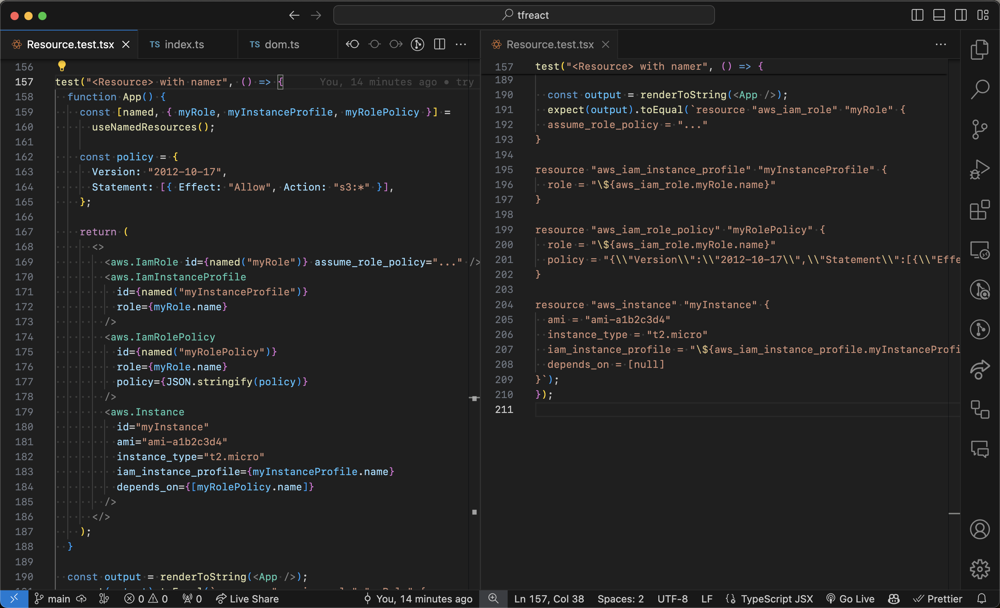

An experiment writing a React-based Terraform templating tool.

I was looking around and saw there's [quite a few projects](https://github.com/chentsulin/awesome-react-renderer) that design custom React renderers to allow you to render content besides HTML.
So, why not try Terraform for fun?

Inspiration:
- https://github.com/chentsulin/awesome-react-renderer
- https://github.com/aws/aws-cdk-rfcs/issues/256
- https://github.com/vadimdemedes/ink
- https://github.com/diegomura/react-pdf
